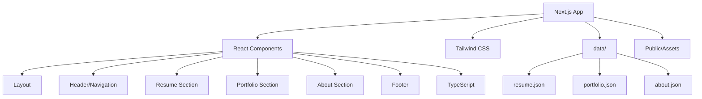

# Website Redesign Plan for Krystropolis.github.io

## Status: 🟢 Core Implementation Complete (2026-01-24)

### Overall Progress
- **Phases 1-5**: ✅ Completed (Project Setup, Data & Types, Core Components, Sections, Styling & Polish)
- **Phase 6**: 🔄 In Progress (Content Refinement - awaiting user updates)
- **Phase 7**: ⏳ Not Started (Testing & Optimization)
- **Phase 8**: 🔄 In Progress (Deployment & Cleanup - GitHub Actions configured, deployment pending)

### Completed Features
- ✅ Next.js 14+ with TypeScript and Tailwind CSS
- ✅ All core pages (Home, Resume, Portfolio, About, Contact)
- ✅ Responsive design with dark mode toggle
- ✅ Accessibility features (ARIA labels, semantic HTML, focus indicators)
- ✅ Data-driven content from JSON files
- ✅ Contact page with spam protection (2026-01-24)

### See Also
- [`implementation-progress.md`](./implementation-progress.md) - Detailed implementation progress tracking
- [`contact-page-implementation.md`](./contact-page-implementation.md) - Contact page implementation plan (completed)

## Overview
Transform the stale 2018 resume website into a cohesive, mature (yet still playful), and well-organized personal portfolio site using modern web technologies and a data-driven approach.

## Current State Analysis

### Issues Identified
- **Deprecated Technology**: Material Design Lite (last updated 2016), jQuery 2.1.4
- **Dated Design**: 2018-era Material Design patterns
- **Hardcoded Content**: Resume data embedded in HTML, difficult to update
- **Stale Content**: Copyright from 2018, likely outdated experience
- **Limited Responsiveness**: Basic mobile support, not optimized for modern devices

### Strengths to Preserve
- Personal, playful tone and personality
- Good content structure (Resume, Portfolio, About)
- Single-page application architecture
- Custom branding (logo, personal touches)

## Design Goals

1. **Cohesive Visual Design**: Unified color scheme, consistent spacing, modern typography
2. **Mature Yet Playful**: Professional presentation while maintaining personality
3. **Well Organized**: Clear information hierarchy, intuitive navigation
4. **Easy to Maintain**: Data-driven content management
5. **Modern & Accessible**: Responsive design, semantic HTML, good contrast ratios

## Technology Stack

### Core Technologies
- **Next.js 14+**: React framework with App Router for SEO, performance, and modern React patterns
- **React 18+**: Component-based UI library with hooks
- **Tailwind CSS**: Modern utility-first CSS framework
- **TypeScript**: Type safety and better developer experience
- **JSON**: Data storage for easy content updates

### Why This Stack?
- **Next.js**: Server-side rendering for SEO, excellent performance, modern React patterns, industry-standard
- **React**: Component-based architecture, reusable components, huge ecosystem
- **Tailwind**: Rapid development, consistent design, easy customization, great documentation
- **TypeScript**: Catch errors early, better IDE support, industry best practice
- **JSON**: Easy to edit, version control friendly, simple structure

## Architecture Overview



## Project Structure

```
Krystropolis.github.io/
├── app/                      # Next.js App Router
│   ├── layout.tsx           # Root layout with Header/Footer
│   ├── page.tsx             # Home page
│   ├── resume/               # Resume section
│   │   └── page.tsx
│   ├── portfolio/            # Portfolio section
│   │   └── page.tsx
│   ├── about/                # About section
│   │   └── page.tsx
│   └── contact/              # Contact section (2026-01-24)
│       └── page.tsx
├── components/               # React components
│   ├── Header.tsx           # Navigation header
│   ├── Footer.tsx           # Footer component
│   ├── ContactForm.tsx      # Contact form component (2026-01-24)
│   ├── PrintButton.tsx      # Print-friendly resume button
│   ├── Resume/
│   │   ├── Experience.tsx   # Experience timeline
│   │   ├── Education.tsx    # Education cards
│   │   └── Skills.tsx       # Skills grid
│   ├── Portfolio/
│   │   └── ProjectCard.tsx  # Individual project card
│   └── About/
│       └── InterestCard.tsx # Interest/hobby card
├── data/                     # JSON data files
│   ├── resume.json          # Resume data
│   ├── portfolio.json       # Portfolio projects
│   ├── about.json           # About section content
│   └── contact.json         # Contact data (2026-01-24)
├── public/                   # Static assets
│   └── images/              # Existing images
├── styles/                   # Custom styles
│   └── globals.css          # Global CSS + Tailwind directives
├── lib/                      # Utility functions
│   └── data.ts              # Data loading helpers
├── types/                    # TypeScript types
│   └── index.ts             # Type definitions
├── next.config.mjs          # Next.js configuration
├── tailwind.config.ts       # Tailwind configuration
├── tsconfig.json            # TypeScript configuration
├── package.json             # Dependencies
└── README.md                # Project documentation
```

## Data Structure Design

**Important**: The JSON data structures below are starting points based on your current content. We will evaluate and refine these structures during implementation to ensure they best serve your needs. The data structure should be:

1. **Easy to update**: Simple and intuitive for you to edit
2. **Flexible**: Accommodate future changes without major restructuring
3. **Efficient**: Optimized for how components will consume the data
4. **Type-safe**: Well-defined TypeScript interfaces for validation

We'll iterate on the structure as we build components and discover what works best.

### resume.json Structure (Draft)
```json
{
  "contact": {
    "email": "e.krystal@gmail.com",
    "location": "Dallas, TX"
  },
  "experience": [
    {
      "position": "Application Developer II",
      "company": "ARGO Data",
      "location": "Richardson, TX",
      "startDate": "2018-02",
      "endDate": "2018-03",
      "isCurrent": false,
      "description": [
        "Employed rapid prototyping to quickly fabricate product models..."
      ]
    }
  ],
  "education": [
    {
      "degree": "B.S. Software Engineering",
      "school": "Penn State Behrend",
      "graduationDate": "2017-05",
      "gpa": "3.37"
    }
  ],
  "skills": {
    "programming": {
      "intermediate": ["Java", "JavaScript", "HTML", "CSS", "C++"],
      "novice": ["C", "C#", "Python", "VB.Net"]
    },
    "databases": ["MS Access", "SQL", "Oracle"],
    "tools": ["Atlassian", "Bootstrap", "Git", "SVN", "Swagger"],
    "languages": ["English (Native)", "Spanish (Novice)", "German (Novice)"]
  }
}
```

### portfolio.json Structure (Draft)
```json
{
  "projects": [
    {
      "title": "BroBot the Boe-Bot",
      "description": "Robotics project using Parallax BASIC Stamp 2...",
      "technologies": ["Embedded C", "Robotics", "Sensors"],
      "images": ["images/boebot2.jpg"],
      "links": []
    }
  ]
}
```

### about.json Structure (Draft)
```json
{
  "intro": "Software Engineer with a passion for...",
  "interests": [
    {
      "title": "Penn State Makers Club 2015",
      "description": "I like to tinker...",
      "image": "images/makers.jpg"
    }
  ]
}
```

### contact.json Structure (Implemented 2026-01-24)
```json
{
  "title": "Get in Touch",
  "subtitle": "Have a question or want to work together?",
  "email": "e.krystal@gmail.com",
  "location": "Dallas, TX",
  "socialLinks": [
    {
      "label": "GitHub",
      "url": "https://github.com/krystalelliott",
      "icon": "github"
    },
    {
      "label": "LinkedIn",
      "url": "https://linkedin.com/in/krystalelliott",
      "icon": "linkedin"
    }
  ],
  "form": {
    "fields": {
      "name": {
        "label": "Your Name",
        "placeholder": "John Doe",
        "required": true
      },
      "email": {
        "label": "Your Email",
        "placeholder": "john@example.com",
        "required": true,
        "type": "email"
      },
      "subject": {
        "label": "Subject",
        "placeholder": "Project Inquiry",
        "required": true
      },
      "message": {
        "label": "Message",
        "placeholder": "Tell me about your project...",
        "required": true,
        "rows": 5
      }
    },
    "honeypot": {
      "name": "website",
      "label": "Leave this field empty"
    },
    "submit": {
      "label": "Send Message",
      "successMessage": "Message sent successfully!",
      "errorMessage": "Failed to send message. Please try again."
    }
  },
  "emailFallback": {
    "label": "Or email me directly:",
    "linkText": "e.krystal@gmail.com"
  }
}
```

## Data Structure Evaluation Process

During implementation, we will:

1. **Extract Current Content**: Migrate your existing content to JSON
2. **Build Components**: Create React components that consume the data
3. **Evaluate Structure**: Assess if the JSON organization makes sense for:
   - How components access the data
   - How easy it is for you to update
   - How well it handles future additions
4. **Iterate**: Refine the structure based on real-world usage
5. **Document**: Final structure with clear examples

### Questions We'll Answer During Evaluation

- Should skills be grouped differently (by proficiency, by category, or flat)?
- Should experience include more metadata (technologies used, team size, etc.)?
- Should portfolio projects have a different structure for different project types?
- Should the about section be more flexible for different content types?
- ~~Should we separate contact information into its own file?~~ ✅ **Completed** - Contact data is now in `contact.json`

**You are not locked into any structure** - we'll find what works best for your specific needs!

## Design System

### Color Palette
- **Primary**: Deep blue/indigo (professional, trustworthy)
- **Accent**: Coral or warm pink (playful, energetic)
- **Background**: Off-white/light gray (clean, readable)
- **Text**: Dark gray (high contrast, professional)

### Typography
- **Headings**: Modern sans-serif (Inter or similar)
- **Body**: Clean sans-serif with good line height
- **Accent**: Playful font for personal touches (logo, quotes)

### Spacing & Layout
- Consistent spacing scale (4px, 8px, 16px, 24px, 32px, 48px, 64px)
- Max-width containers for readability (1200px desktop, 640px mobile)
- Generous white space for breathing room

## Component Design

### Header & Navigation
- Fixed or sticky header
- Logo on left, navigation on right
- Mobile: Hamburger menu with slide-out drawer
- Active state indication
- Smooth scroll to sections

### Resume Section
- Timeline-style experience display
- Clean card-based layout for skills
- Responsive grid for education
- Print-friendly styling option

### Portfolio Section
- Grid layout for projects
- Hover effects for interactivity
- Technology tags for each project
- Image galleries with lightbox (optional)

### About Section
- Hero section with personal photo
- Grid layout for interests
- Cards for each interest/hobby
- Personal quotes or highlights

### Contact Section (Implemented 2026-01-24)
- Contact form with validation
- Honeypot field for spam protection
- Email obfuscation for fallback link
- Social links section
- Success/error states
- Responsive design with dark mode support

## Content Updates Needed

### Professional Tone Refinement
- Review all copy for professionalism
- Maintain personality but reduce casual language
- Ensure consistent voice throughout
- Update any outdated references

### New Experience
- User will provide new work experience since 2018
- Update skills with recent technologies
- Add new portfolio projects if available
- Update contact information if changed

## Implementation Steps

### Phase 1: Project Setup
1. Initialize Next.js project with TypeScript and Tailwind CSS
2. Configure Tailwind CSS with custom color palette
3. Set up project structure (app/, components/, data/, etc.)
4. Create TypeScript type definitions
5. Set up data loading utilities

### Phase 2: Data Migration
1. Extract current content into JSON files
2. Structure data according to new schema
3. Create TypeScript interfaces for data validation
4. Test data loading in Next.js

### Phase 3: Core Components
1. Create root layout with Header and Footer
2. Build Header component with navigation
3. Build Footer component
4. Create reusable UI components (cards, buttons, etc.)

### Phase 4: Section Development
1. Create Resume section with Experience, Education, Skills components ✅
2. Create Portfolio section with ProjectCard components ✅
3. Create About section with InterestCard components ✅
4. Implement smooth page transitions ✅
5. Create Contact section with ContactForm component and spam protection ✅ (2026-01-24)

### Phase 5: Styling & Polish
1. Apply Tailwind classes for responsive design
2. Add custom CSS for specific effects
3. Implement mobile menu
4. Add micro-interactions and hover effects
5. Optimize images and assets

### Phase 6: Content Refinement
1. Update content for professional yet personal tone
2. Add new experience (user-provided)
3. Update skills and portfolio projects
4. Review and refine all copy

### Phase 7: Testing & Optimization
1. Test responsiveness across devices
2. Test cross-browser compatibility
3. Check accessibility (WCAG AA)
4. Optimize performance (images, code splitting)
5. Verify SEO (meta tags, sitemap)

### Phase 8: Deployment & Cleanup
1. Build production bundle
2. Test production build locally
3. Remove old files (index.html, styles.css, script.js, about.html, resume.html, portfolio.html)
4. Update README with new setup instructions
5. Deploy to GitHub Pages or other hosting

## Accessibility Considerations
- Semantic HTML elements
- ARIA labels where needed
- Keyboard navigation support
- Color contrast ratios (WCAG AA)
- Alt text for images
- Focus indicators

## Performance Considerations
- Lazy load images
- Optimize image sizes
- Minimize JavaScript bundle
- Use Tailwind's purge/unused CSS removal
- Leverage browser caching

## Included Enhancements

The following features are included in this project to improve both viewer experience and learning opportunities:

### Viewer Experience
- **Dark mode toggle**: Popular feature, better for low-light viewing ✅
- **Print-friendly resume PDF**: One-click resume download for recruiters ✅
- **Smooth scroll animations**: Subtle animations for better UX ✅
- **Loading states**: Skeleton screens while content loads ✅
- **Contact form with spam protection**: Professional contact method with honeypot and email obfuscation ✅ (2026-01-24)

### Learning Experience
- **ESLint + Prettier**: Code quality and formatting best practices
- **Component testing**: Jest + React Testing Library for test-driven development
- **Performance monitoring**: Lighthouse CI, Web Vitals tracking

## Future Enhancements (Optional)

### Additional Viewer Experience Improvements
- ~~**Contact form**~~ ✅ **Completed** (2026-01-24)
- **Social media links**: LinkedIn, GitHub, Twitter/X, etc.
- **Blog integration**: Pull in posts from your existing blogspot
- **Portfolio filtering**: Filter projects by technology, type, or date
- **Image lightbox**: Better viewing of portfolio images
- **Search functionality**: Search portfolio projects or skills
- **Testimonials/recommendations**: Add quotes from colleagues or clients
- **Internationalization**: Support for German/Spanish (you mentioned learning these)
- **Progressive Web App (PWA)**: Installable, offline support

### Additional Learning Experience Enhancements
- **Storybook**: Component development and documentation tool
- **CI/CD pipeline**: GitHub Actions for automated testing and deployment ✅ (configured)
- **Error boundaries**: Better error handling and user experience
- **Custom hooks**: Reusable logic patterns (e.g., useData, useTheme)
- **State management**: Context API or Zustand if complexity grows
- **API integration**: Fetch data via Next.js API routes instead of static JSON
- **Environment variables**: Secure configuration management
- **Type safety improvements**: Strict TypeScript mode, Zod for runtime validation
- **Headless CMS**: Consider Sanity, Contentful, or Strapi as alternative to JSON
- **Analytics integration**: Google Analytics or Plausible for visitor insights
- **A/B testing**: Test different layouts or copy for optimization
- **Backend integration for contact form**: Email service integration (SendGrid, Resend, Formspree)

## Git Workflow & Version Control

### Commit Strategy
Following a disciplined Git workflow ensures you can track progress, easily revert changes if needed, and maintain a clean history. Here's when to make commits:

#### Phase 1: Project Setup
- **Commit 1**: Initialize Next.js project with TypeScript and Tailwind
  ```
  feat: initialize Next.js project with TypeScript and Tailwind CSS
  ```
- **Commit 2**: Configure Tailwind CSS with custom color palette
  ```
  style: configure Tailwind CSS with custom color palette
  ```
- **Commit 3**: Set up project structure (app/, components/, data/, types/)
  ```
  chore: set up project directory structure
  ```
- **Commit 4**: Configure ESLint, Prettier, and eslint-plugin-jsx-a11y
  ```
  style: configure ESLint, Prettier, and eslint-plugin-jsx-a11y for code quality and accessibility
  ```

#### Phase 2: Data & Types
- **Commit 5**: Create TypeScript type definitions
  ```
  types: add TypeScript interfaces for resume, portfolio, and about data
  ```
- **Commit 6**: Set up data loading utilities
  ```
  utils: add data loading helper functions
  ```
- **Commit 7**: Extract current content into JSON files
  ```
  data: migrate existing content to JSON format (resume, portfolio, about)
  ```

#### Phase 3: Core Components
- **Commit 8**: Create root layout with Header, Footer, and skip link
  ```
  feat: add root layout with Header, Footer, and accessibility skip link
  ```
- **Commit 9**: Build Header component with navigation and dark mode
  ```
  feat: implement Header component with navigation and dark mode toggle
  ```
- **Commit 10**: Build Footer component
  ```
  feat: implement Footer component with accessibility features
  ```

#### Phase 4: Sections
- **Commit 11**: Create Resume section components
  ```
  feat: add Resume section with Experience, Education, and Skills components
  ```
- **Commit 12**: Create Portfolio section components
  ```
  feat: add Portfolio section with ProjectCard components
  ```
- **Commit 13**: Create About section components
  ```
  feat: add About section with InterestCard components
  ```

#### Phase 5: Styling & Interactions
- **Commit 14**: Apply Tailwind styling for responsive design
  ```
  style: apply Tailwind CSS styling for responsive design
  ```
- **Commit 15**: Implement mobile menu with keyboard accessibility
  ```
  feat: add mobile menu with hamburger navigation and keyboard accessibility
  ```
- **Commit 16**: Add dark mode toggle
  ```
  feat: implement dark mode toggle with theme persistence
  ```
- **Commit 17**: Add smooth page transitions and micro-interactions
  ```
  feat: add smooth page transitions and hover effects
  ```
- **Commit 18**: Add loading states (skeleton screens)
  ```
  feat: implement skeleton loading states for better UX
  ```

#### Phase 6: Enhancements
- **Commit 19**: Add print-friendly resume PDF download
  ```
  feat: add print-friendly resume PDF download functionality
  ```
- **Commit 20**: Set up component testing and axe-core
  ```
  test: configure Jest, React Testing Library, and axe-core for accessibility testing
  ```
- **Commit 21**: Add tests for core components
  ```
  test: add unit tests for Header, Footer, and Resume components
  ```

#### Phase 7: Content & Polish
- **Commit 22**: Update content for professional yet personal tone
  ```
  content: refine copy for professional yet personal tone
  ```
- **Commit 23**: Add new work experience (user-provided)
  ```
  data: add new work experience to resume.json
  ```
- **Commit 24**: Evaluate and refine JSON data structure
  ```
  refactor: optimize JSON data structure based on component needs
  ```

#### Phase 8: Testing & Optimization
- **Commit 25**: Test responsiveness and cross-browser compatibility
  ```
  test: verify responsive design across devices and browsers
  ```
- **Commit 26**: Run accessibility audit
  ```
  a11y: run comprehensive accessibility audit with Lighthouse, axe DevTools, and WAVE
  ```
- **Commit 27**: Optimize performance and ensure WCAG AA compliance
  ```
  perf: optimize images, code splitting, and ensure WCAG AA compliance
  ```
- **Commit 28**: Build and test production bundle
  ```
  build: verify production build works correctly
  ```

#### Phase 9: Cleanup & Deployment
- **Commit 29**: Clean up old files
  ```
  chore: remove old HTML, CSS, and JS files
  ```
- **Commit 30**: Update documentation
  ```
  docs: update README with setup instructions, project overview, and accessibility guidelines
  ```
- **Commit 31**: Final review and deployment
  ```
  release: prepare for deployment - final review, accessibility verification, and optimizations
  ```

### Commit Message Convention
Use conventional commits format: `<type>(<scope>): <description>`

**Types:**
- `feat`: New feature
- `fix`: Bug fix
- `style`: Code style changes (formatting, etc.)
- `refactor`: Code refactoring
- `test`: Adding or updating tests
- `docs`: Documentation changes
- `chore`: Build process or auxiliary tool changes
- `perf`: Performance improvements

### Branch Strategy
- **main**: Production-ready code
- **develop**: Active development branch
- **feature/***: Individual features (e.g., feature/dark-mode)
- **fix/***: Bug fixes

For this project, you can work on `main` directly or use a simple `develop` branch if you prefer.

### When to Commit
Make commits when:
1. A feature is complete and working
2. A bug is fixed
3. Refactoring is done
4. Tests are added
5. Configuration changes are made
6. Documentation is updated

**Don't commit when:**
- Code is broken or doesn't compile
- You're in the middle of a large feature (use a feature branch instead)
- You have temporary debugging code

### Git Workflow Tips
- Commit frequently but logically
- Write clear, descriptive commit messages
- Review your changes before committing (`git status`, `git diff`)
- Use `.gitignore` to exclude node_modules, .next, etc.
- Tag important milestones (e.g., `git tag -a v1.0.0 -m "Initial release"`)

## Accessibility Best Practices

This project will follow WCAG 2.1 Level AA guidelines to ensure the site is accessible to all users, including those with disabilities.

### Accessibility Goals
- **WCAG 2.1 Level AA Compliance**: Meet all AA success criteria
- **Keyboard Navigation**: Full keyboard accessibility without mouse
- **Screen Reader Support**: Compatible with NVDA, JAWS, VoiceOver, TalkBack
- **Color Contrast**: Minimum 4.5:1 for normal text, 3:1 for large text
- **Semantic HTML**: Proper use of HTML elements for meaning
- **Focus Management**: Clear focus indicators and logical tab order

### Implementation Guidelines

#### 1. Semantic HTML
```tsx
// Good - Semantic elements
<nav aria-label="Main navigation">
  <ul>
    <li><a href="/resume">Resume</a></li>
  </ul>
</nav>

// Bad - Non-semantic divs
<div class="nav">
  <div class="nav-item" onclick="navigate('resume')">Resume</div>
</div>
```

#### 2. ARIA Attributes
```tsx
// Navigation landmarks
<nav aria-label="Main navigation">

// Live regions for dynamic content
<div role="status" aria-live="polite" aria-atomic="true">
  {loadingMessage}
</div>

// Expandable content
<button aria-expanded={isOpen} aria-controls="menu">
  Menu
</button>
<div id="menu" hidden={!isOpen}>
  {/* Menu content */}
</div>

// Icon buttons
<button aria-label="Toggle dark mode">
  <DarkModeIcon />
</button>
```

#### 3. Keyboard Navigation
```tsx
// All interactive elements must be keyboard accessible
<button onClick={handleClick}>Click me</button> // Button is keyboard accessible
<div onClick={handleClick}>Click me</div> // Div is not keyboard accessible

// Handle keyboard events
const handleKeyDown = (e: KeyboardEvent) => {
  if (e.key === 'Enter' || e.key === ' ') {
    handleClick();
  }
};

<div
  role="button"
  tabIndex={0}
  onClick={handleClick}
  onKeyDown={handleKeyDown}
>
  Click me
</div>
```

#### 4. Color Contrast
- Use Tailwind's accessible color palette
- Test contrast ratios with tools like WebAIM Contrast Checker
- Ensure text remains readable in both light and dark modes

#### 5. Focus Indicators
```css
/* Custom focus styles in Tailwind */
.focus-visible:focus {
  outline: 2px solid #3b82f6;
  outline-offset: 2px;
}
```

#### 6. Images and Media
```tsx
// Always provide alt text


// Decorative images


// Images with complex descriptions

```

#### 7. Forms
```tsx
// Always associate labels with inputs
<label htmlFor="email">Email address</label>
<input id="email" type="email" required />

// Error messages
<div role="alert" aria-live="assertive">
  {error && <p>{error}</p>}
</div>
```

#### 8. Skip Links
```tsx
// Skip to main content link for keyboard users
<a
  href="#main-content"
  className="sr-only focus:not-sr-only focus:absolute focus:top-4 focus:left-4"
>
  Skip to main content
</a>

<main id="main-content">
  {/* Main content */}
</main>
```

### Accessibility Tools & Testing

#### Development Tools
- **ESLint Plugin**: `eslint-plugin-jsx-a11y` - Catch accessibility issues during development
- **axe DevTools**: Browser extension for accessibility testing
- **Lighthouse**: Built-in Chrome accessibility audit
- **WAVE**: Web Accessibility Evaluation Tool

#### Automated Testing
```bash
# Install axe-core for automated testing
npm install --save-dev @axe-core/react

# Run accessibility tests in Jest
npm test -- --coverage
```

#### Manual Testing Checklist
- [ ] Navigate entire site using only keyboard (Tab, Enter, Escape, Arrow keys)
- [ ] Test with screen reader (NVDA for Windows, VoiceOver for Mac)
- [ ] Verify all images have appropriate alt text
- [ ] Check color contrast ratios meet WCAG AA
- [ ] Ensure focus indicators are visible on all interactive elements
- [ ] Test with browser zoom (up to 200%)
- [ ] Verify mobile touch targets are at least 44x44 pixels
- [ ] Check that content remains readable when text is resized

### Accessibility Commitments

#### During Development
1. **Code Reviews**: Include accessibility in all code reviews
2. **Component Library**: Build accessible, reusable components
3. **Testing**: Run accessibility tests with every commit
4. **Documentation**: Document accessibility patterns and best practices

#### Specific Component Requirements

**Header/Navigation**
- Skip link for keyboard users
- Proper ARIA labels for navigation
- Mobile menu keyboard accessible
- Current page indication
- Focus trap in mobile menu when open

**Resume Section**
- Proper heading hierarchy (h1, h2, h3)
- Experience timeline accessible to screen readers
- Print-friendly styles maintain readability
- PDF download button has proper label

**Portfolio Section**
- Project cards have proper heading structure
- Images have descriptive alt text
- Links to external projects clearly indicate they open in new tab
- Filter controls are keyboard accessible

**About Section**
- Interest cards have proper structure
- Images have alt text
- Personal content is readable and well-structured

**Footer**
- Social media links have proper labels
- Contact information is accessible
- Copyright notice is properly formatted

### Accessibility Resources
- [WCAG 2.1 Guidelines](https://www.w3.org/WAI/WCAG21/quickref/)
- [WebAIM Accessibility Checklist](https://webaim.org/standards/wcag/checklist)
- [A11Y Project Checklist](https://www.a11yproject.com/checklist/)
- [React Accessibility Documentation](https://react.dev/learn/accessibility)

## Success Criteria
- [ ] Modern, cohesive design
- [ ] Professional yet personal tone
- [ ] Easy content updates via JSON
- [ ] Fully responsive (mobile, tablet, desktop)
- [ ] Accessible (WCAG AA compliant)
- [ ] Fast loading (< 3 seconds)
- [ ] Cross-browser compatible
- [ ] Clean, organized codebase

## Notes for User
- Next.js provides server-side rendering for excellent SEO and performance
- TypeScript adds type safety and better developer experience
- JSON files make it easy to update your resume without touching React components
- The single-page application feel is maintained with Next.js client-side navigation
- You can add your new experience by editing `data/resume.json`
- Consider updating the copyright year to current year
- This stack (Next.js + React + Tailwind + TypeScript) is industry-standard for modern web development
- GitHub Pages requires a static export from Next.js (`next export` or `output: 'export'` in config)
